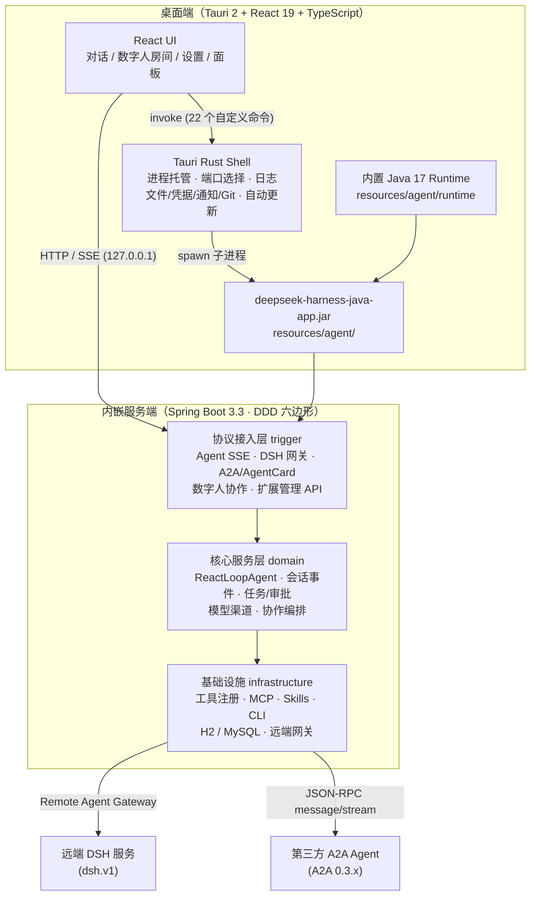
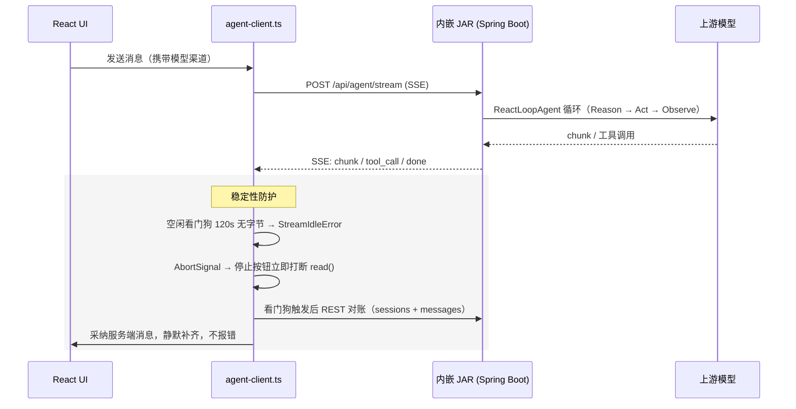
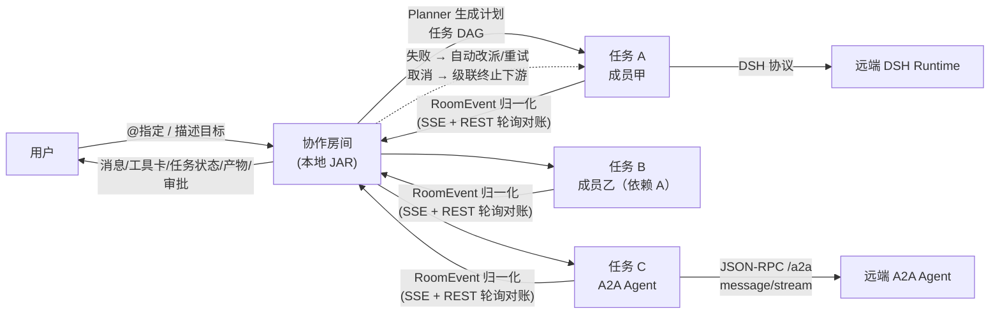

# DSH Java Desktop

`DSH Java Desktop` 是 `deepseek-harness-java`（Agent Runtime 服务端）的桌面工作台：使用 **TypeScript + React** 构建界面，使用 **Tauri 2** 负责窗口、进程与本机能力；智能体能力不重复实现，而是由桌面壳启动 `deepseek-harness-java` 的 Spring Boot JAR，并通过本机 HTTP/SSE API 调用。

一句话概括：**一款开箱即用的「数字人」AI 智能体桌面端 —— 内置 DSH Java Agent Runtime，零依赖装完即用；单个数字人胜任编码、绘图、文档等多场景工作，多个数字人经 dsh.v1 / A2A 跨端组建协作团队，插件 / Skills / MCP / CLI 随需扩展。**

---

## 目录

- [整体方案](#整体方案)
- [能力全景](#能力全景)
- [架构](#架构)
- [目录结构](#目录结构)
- [使用方式](#使用方式)
  - [快速开始](#快速开始)
  - [开发运行](#开发运行)
  - [模型配置](#模型配置)
  - [数字人与协作房间](#数字人与协作房间)
  - [扩展能力（Skills / MCP / CLI）](#扩展能力skills--mcp--cli)
  - [资源插件与文件产物](#资源插件与文件产物)
  - [运行信息面板](#运行信息面板)
- [发布与自动更新](#发布与自动更新)
- [诊断与常见问题](#诊断与常见问题)
- [相关文档](#相关文档)

---

## 整体方案

项目的核心设计决策是"**桌面端只做壳，能力由服务端承载**"：

1. **智能体能力内嵌而非重写**。`deepseek-harness-java-app.jar`（Spring Boot，DDD 六边形架构）直接作为 Tauri bundle resource 内置到安装包（`resources/agent/`）。ReactLoopAgent 主循环、会话事件溯源、工具注册与执行、任务队列、权限审批、模型渠道管理、数字人协作域，全部由服务端实现，桌面端只做 UI 投影。
2. **standalone profile + 本地 H2**。桌面场景零外部依赖，不要求先部署 MySQL；数据落在应用数据目录。
3. **Rust 层托管进程**。Tauri Rust 层负责选择空闲端口、拉起/停止 JAR 子进程、捕获日志、记录运行状态（`<app-data-dir>/agent-runtime.json`）；上次异常退出时下次启动会先清理遗留 JAR 进程，避免 H2 文件锁冲突。前端不暴露任何执行命令的安全面。
4. **内置 Java 17 Runtime**。发布版使用应用内置的 Temurin JRE 17（`resources/agent/runtime`，由准备脚本按平台下载），用户无需安装或配置 JDK，应用也不会修改用户的 `JAVA_HOME` / `PATH`。开发环境按 `DSH_AGENT_JAVA` → 内置 Runtime → 系统 `java` 的顺序选择，版本必须 ≥ 17。
5. **本机回环通信**。桌面 UI 仅通过 `127.0.0.1` 调用服务，本地端口不进入主对话区，只在设置页展示诊断信息。
6. **Tauri 原生能力补齐桌面体验**。本地文件读写/预览/右键操作、目录/文件选择、凭据安全存储、系统通知、Git 分支查看与切换、自动更新等，由 22 个自定义 Rust 命令提供。
7. **开放协议接入远端智能体**。服务端实现 DSH v1 Agent Card（`/.well-known/dsh-agent-card`）与标准 **A2A 0.3.x** 协议（`/.well-known/agent-card.json` + JSON-RPC `/a2a` 端点），远端 DSH / A2A 服务均可被发现并接入为数字人，与本地智能体同房间协作。

## 能力全景

| 能力域 | 覆盖内容 |
| --- | --- |
| 对话与工作区 | 项目/工作区选择（含多子工程）、会话管理（置顶、自定义标题、排序）、流式消息（SSE）、Markdown/GFM 渲染、停止生成 |
| 流式稳定性 | 空闲看门狗（120s 无字节中断）、AbortSignal 接入读循环、失败后按 agentId 走 REST 对账静默兜底、房间流指数退避自动重连 + 事件续传 + 运行期 5s REST 轮询对账 |
| 模型接入 | 渠道模板、Base URL + API Key 配置、同步上游模型列表、模型激活与删除、运行时模型切换 |
| 工具审批 | 运行期工具调用以对话区内紧凑提示条处理，允许/拒绝 |
| 资源插件 | 内置 **Word / Excel / Markdown / ECharts / draw.io** 五类资源生成，各有专属图标与预览 |
| draw.io | 内嵌 embed.diagrams.net：预览（chromeless）/ 编辑（kennedy UI + 800ms 防抖自动保存落盘） |
| 文件产物 | 消息内联文件卡片（代码文件带行号源码查看）、按扩展名分类图标与颜色、右键菜单（打开 / 打开文件夹 / 另存为 / 复制路径）、目录识别与打开、失效路径置灰标识 |
| 数字人协作 | 数字人目录（本地 DSH / 远端 DSH / A2A 三类接入）、添加向导（自动探测 Agent Card）、协作房间、群聊消息流、任务编排（Planner 自动分工 + 任务 DAG 依赖）、成员定向问答（ASK 协议）、失败自动恢复（改派/重试）、任务取消与级联终止、产物卡与审批 |
| 开放协议 | 服务端侧：DSH v1 卡片、A2A 0.3.x 标准卡片与 JSON-RPC（message/send、message/stream SSE、tasks/get、tasks/cancel）；客户端侧：双协议探测发现、凭据随请求携带 |
| 扩展管理 | 设置页统一管理：**Skills**（Git 安装 / 启停 / 删除）、**MCP Servers**（增删改 + 保存前测连 + 运行期热更新）、**CLI 命令**（claude / codex / acp）；服务端同时注册 6 个 `extension_*` 对话工具，可在对话中直接管理扩展 |
| 运行信息面板 | 工作区与子工程的 Git 分支展示与下拉切换（git checkout）、Git 变更查看 |
| 桌面体验 | 系统通知（未聚焦会话时）、对话完成提示音（Web Audio 合成，成功/失败双音）、侧边栏拖宽、自动更新 |

## 架构

### 总体架构



### 对话流式链路（含稳定性防护）



### 数字人协作链路



### 关键稳定性设计

数字人流式链路历经多轮"生成中永久卡死"问题修复，当前防护体系：

| 层 | 机制 | 说明 |
| --- | --- | --- |
| Agent 对话流 | 空闲看门狗 | 120s 无任何字节强制中断（工具长执行期间 SSE 可能静默，不能设太小） |
| Agent 对话流 | AbortSignal 打断 | 停止按钮/看门狗可立即打断挂起的 `reader.read()` |
| Agent 对话流 | REST 对账兜底 | 中断后按 agentId 拉取会话与消息，与服务端比对采纳，静默补齐 |
| 房间事件流 | 指数退避重连 | 1s→15s 封顶自动重连，`afterSeq` 按最新 seq 续传（服务端自动重放 backlog） |
| 房间事件流 | 空闲看门狗 | 10 分钟（房间流空闲是常态，服务端 SseEmitter 无心跳） |
| 房间事件流 | 运行期对账轮询 | 任务运行期间每 5s 补拉事件 + 刷新快照，不依赖 SSE 存活 |
| 服务端 | 取消语义完整 | 任务注册表 + FutureTask 取消 + 状态不被覆盖 + 下游级联置 FAILED |
| 服务端 | 失败自动恢复 | 每任务 1 次恢复预算：优先改派（优先同能力标签），无候选则同员重试，耗尽才级联终止 |

## 目录结构

```text
DSH-Java-Desktop/
├── src/                        # React 前端
│   ├── App.tsx                 # 应用主容器（会话/项目/流式/对账）
│   ├── components/             # UI 组件（对话、房间、设置、预览、面板）
│   ├── lib/                    # agent-client / digital-human-client /
│   │                           # room-feed / react-drawio / sound / fileType
│   └── types.ts                # 类型定义（含资源插件 kind）
├── src-tauri/                  # Tauri Rust 壳
│   └── src/lib.rs              # 22 个自定义命令 + 进程托管 + 更新
├── resources/agent/            # 内嵌服务端 JAR + Java 17 Runtime（不入 Git）
├── scripts/prepare-runtime.mjs # 按平台下载 Temurin JRE 17
├── docs/                       # 架构/设计文档 + 本总览页
└── data/                       # 本地数据
```

配套服务端工程：`../deepseek-harness-java`（与本项目同级）。**服务端改动后必须重新打包 JAR 并覆盖 `resources/agent/deepseek-harness-java-app.jar`**，桌面端才会用上新服务端。

---

## 使用方式

### 快速开始

从 [GitHub Releases](https://github.com/fuzhengwei/DSH-Java-Desktop/releases/latest/download/latest.json) 下载对应平台安装包（macOS Apple Silicon / macOS Intel / Windows x64 / Linux x64），安装后：

1. 应用启动即自动拉起内置智能体服务（无需装 JDK / 数据库）；
2. 打开左下角「设置」→「智能体服务连接」确认服务就绪；
3. 配置模型（见下文）即可开始对话。

### 开发运行

```bash
npm install          # 换机器/拉新代码后如报 Failed to resolve import，先执行这步
npm run tauri dev
```

开发时若 `resources/agent/` 下没有 JAR，Rust 层会回退查找 `../deepseek-harness-java/deepseek-harness-java-app/target/deepseek-harness-java-app.jar`（Maven finalName，无版本号）。

构建发布包（自动完成：构建服务端 JAR → 复制 → 下载当前平台 JRE 17）：

```bash
npm run tauri:build
```

跨平台准备 Runtime 资源：

```bash
DSH_JRE_TARGET=darwin-arm64 npm run agent:runtime
DSH_JRE_TARGET=win32-x64 npm run agent:runtime
```

> 发布版如果内置 Runtime 缺失、损坏或版本低于 17，设置页会显示具体 Java 路径、版本和错误原因；正式构建缺少 Runtime 会直接提示准备资源，不会静默依赖系统 Java。

### 模型配置

1. 应用启动后打开左下角「设置」；
2. 选择渠道模板，填写 Base URL 和 API Key；
3. 点击「同步模型」获取上游模型列表，或直接输入模型编码；
4. 点击「保存模型」，桌面端会保存服务端返回的 `channelCode` 并立即激活；
5. 顶部模型选择器随后显示运行时模型，发消息时自动携带该渠道。

模型配置正确但上游不可用时，对话区会显示智能体返回的错误，不会导致桌面端进程崩溃。

### 数字人与协作房间

**添加数字人**：设置页 → 数字人目录 →「添加数字人」，选择来源（本地 DSH / 远端 DSH / A2A），填写 Base URL 与凭据，应用自动探测 `/.well-known/` 下的 Agent Card（DSH v1 与 A2A 0.3.x 双协议），预填名称、用途与能力后确认接入。

**房间协作**：

1. 对话中邀请数字人加入房间（可多个）；
2. `@成员名` 定向派发，或直接描述目标由 Planner 自动分工生成任务 DAG；
3. 无依赖任务并行执行，有依赖的任务等上游产物就绪后自动续跑；
4. 成员执行中可定向提问（ASK 协议），答复自动注入指令续跑；
5. 失败任务自动改派/重试（每任务 1 次恢复预算）；可随时取消（下游级联终止）；
6. 工具调用与产物在对话流与右侧协作面板实时可见，危险操作走审批提示条。

### 扩展能力（Skills / MCP / CLI）

设置页 →「扩展能力」：

| 类型 | 支持操作 |
| --- | --- |
| Skills | Git 仓库安装（本地路径或远程 Git）、启用/停用、删除 |
| MCP Servers | 新增/编辑/删除（stdio 等传输）、保存前自动测试连接并发现工具、运行期热连接/断开 |
| CLI 命令 | 配置 claude / codex（热更新生效）与 acp 子代理（提示重启生效） |

扩展配置持久化在 `~/.dsh/extensions.json`；同时注册了 6 个 `extension_*` 对话工具，可直接在对话中说"帮我安装某个技能"由智能体代为操作。MCP 配置可与 preset 同名覆盖（同名 custom 优先）。

### 资源插件与文件产物

对话输入区「+」菜单可让智能体生成五类资源：

| 插件 | 产物 | 预览能力 |
| --- | --- | --- |
| Word | .docx 文档 | 文本预览 |
| Excel | .xlsx 表格 | 表格预览 |
| Markdown | .md 文档 | Markdown 渲染 |
| ECharts | 图表 | ECharts 渲染 |
| draw.io | .drawio 图 | 内嵌 diagrams.net 预览与编辑（编辑自动落盘；需外网访问 embed.diagrams.net，离线时显示提示不影响文件内容） |

消息正文与产物区的文件卡片支持：左键点击在右侧面板预览（代码文件带行号查看）、右键菜单（打开 / 打开文件夹 / 另存为 / 复制路径）；目录卡片直接交给文件管理器打开；相对路径按当前项目根解析；不存在的路径置灰标识"未找到"。

### 运行信息面板

右侧信息栏展示当前工作区与子工程的 Git 状态：分支可下拉查看并直接切换（执行 `git checkout`），同时支持查看工作区变更。多工程工作区按子工程逐个展示。

---

## 发布与自动更新

四个平台使用独立 tag 分别触发构建；成功后安装包与 Tauri updater 签名文件上传到对应 `dsh-java-desktop-v*` GitHub Release：

| 平台 | Tag |
| --- | --- |
| Linux x64 | `linux-x64-v*` |
| Windows x64 | `windows-x64-v*` |
| macOS Apple Silicon | `macos-apple-silicon-v*` |
| macOS Intel | `macos-intel-v*` |

应用通过以下端点检查更新（启动时自动检查，发现新版本可一键下载安装并重启）：

```text
https://github.com/fuzhengwei/DSH-Java-Desktop/releases/latest/download/latest.json
```

CI 需在仓库 `Settings → Secrets and variables → Actions` 配置：

| Secret | 用途 |
| --- | --- |
| `TAURI_SIGNING_PRIVATE_KEY` | Tauri 自动更新包签名私钥 |
| `TAURI_SIGNING_PRIVATE_KEY_PASSWORD` | 签名私钥密码，无密码可为空 |
| `APPLE_CERTIFICATE` | macOS Developer ID Application 证书 `.p12` 的 Base64 内容 |
| `APPLE_CERTIFICATE_PASSWORD` | 上述 `.p12` 证书密码 |
| `APPLE_SIGNING_IDENTITY` | macOS 代码签名身份名称 |
| `APPLE_ID` | macOS 公证使用的 Apple ID |
| `APPLE_PASSWORD` | macOS 公证使用的 App-Specific Password |
| `APPLE_TEAM_ID` | Apple 开发者 Team ID |

`GITHUB_TOKEN` 不需要手动配置。updater 私钥位置见 `src-tauri/updater.key`，公开签名密钥已写入 `src-tauri/tauri.conf.json`。

---

## 诊断与常见问题

**日志位置**：`<app-data-dir>/logs/agent.log`（macOS 为 `~/Library/Application Support/cn.xiaofuge.desktop/logs/agent.log`）。内置服务实际 HTTP 端口以日志中"Web 控制台已就绪：http://localhost:\<port\>/"为准。排查卡死类问题可先看日志，再用 `curl` 直连 `127.0.0.1:<port>/api/agent/stream` 区分服务端/前端问题。

**替换 JAR / 大文件后构建报 `Permission denied (os error 13)`**：`src-tauri/target/debug/agent/` 里的缓存副本是只读的，删除该缓存目录后重新构建即可，不要清整个 `target`。

**`tauri dev` 报 `Port 1420 is already in use` / 残留进程**：npm 包装进程退出不等于应用退出——窗口/内置 java/vite 常作为孤儿存活。干净重启：kill 残留的 `dsh-java-desktop`、`java`、vite（node:1420）进程后再启动。

**旧会话 ID 导致丢上下文**：localStorage 里可能残留旧版本构建的 `collab-<ts>` 前缀会话 ID，会让服务端每次新建 agent；删除对应会话或清理 localStorage 即可。

**draw.io 打不开**：内嵌编辑器需要外网访问 embed.diagrams.net；离线时显示提示但文件内容不受影响。

**停止生成只断开前端连接**：当前停止仅中断 SSE 读取与前端渲染，服务端 agent 会把当前 turn 跑完（后台空转）；彻底取消需服务端中断接口（协作房间的任务取消已实现完整语义）。

## 相关文档

- [本地启动指南](docs/本地启动指南.md) — 从零开始在本机跑起桌面端的完整步骤
- [数字人协作架构设计](docs/architecture/digital-human-agent-architecture.md) — 数字人领域模型、协作机制、事件协议、演进路线
- [数字人实现说明](docs/design/digital-human-implementation.md) / [路线图](docs/design/digital-human-roadmap.md)
- [架构总览页（可视化）](docs/overview.html) — 架构图 + 使用指南的可视化版本
- [架构图源文件（draw.io）](../deepseek-harness-java/docs/md/draw.io/deepseek-harness-java-architecture.drawio) — 服务端全量架构图
- 服务端工程：`deepseek-harness-java`（Spring Boot 3.3 · DDD 六边形 · ReactLoopAgent · 事件溯源 · 插件/MCP/Skills/CLI 扩展体系）
