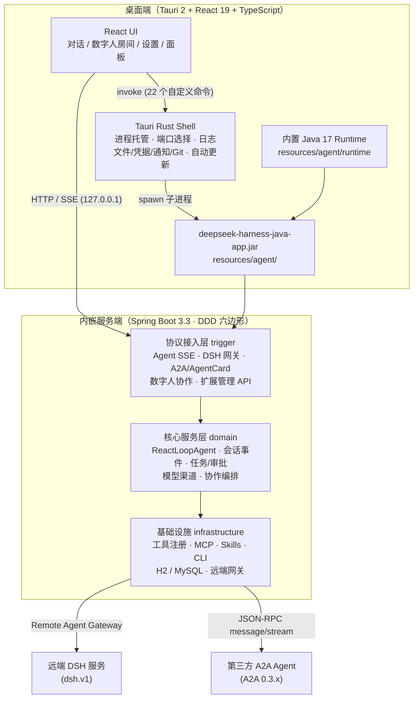
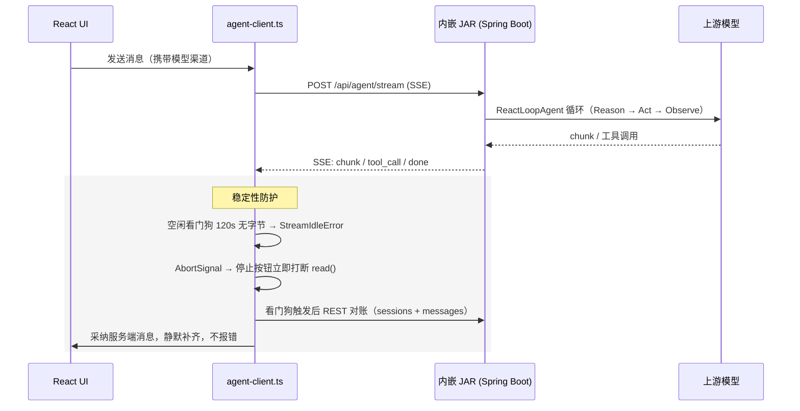
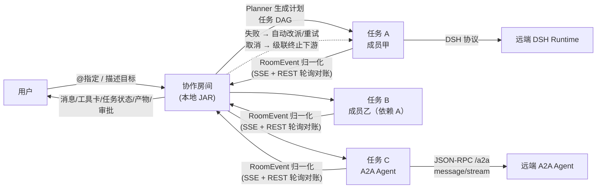

<div align="center">

# DSH Java Desktop

### 数字人 AI 智能体桌面端 · 内置 Agent Runtime · 数字人协作 · A2A 开放协议

[](./src-tauri/tauri.conf.json)
[](#-使用方式)
[](https://tauri.app)

</div>

> **DSH Java Desktop** 是 [deepseek-harness-java](https://t.zsxq.com/kYcVt)（Agent Runtime 服务端）的桌面工作台。它是一款开箱即用的「数字人」AI 智能体桌面端 —— 内置 DSH Java Agent Runtime，零依赖装完即用；单个数字人胜任编码、绘图、文档等多场景工作，多个数字人经 dsh.v1 / A2A 跨端组建协作团队，插件 / Skills / MCP / CLI 随需扩展。
>
> 桌面端只做壳，能力由服务端承载：**TypeScript + React** 构建界面，**Tauri 2** 负责窗口、进程托管与本机能力，智能体能力由 `deepseek-harness-java` 实现，由桌面壳启动内嵌 Spring Boot JAR，经本机 `127.0.0.1` HTTP/SSE API 调用（这个方式也是让壳可以快速接入远程 Agent 的最佳方式）。

**我说3句话；**

1. 👬🏻 此产品 DSH Java Desktop 是 [deepseek-harness-java](https://t.zsxq.com/kYcVt) 的衍生品，支持二开发布，也接受 PR 贡献（合并记得提交到最新分支，不要提主分支）。

2. 👣 加入小傅哥的社群即可获得 [deepseek-harness-java](https://t.zsxq.com/kYcVt) 源码（其实也就相当个token费用，只不过我有更多的架构经验 `13年+老架构师`，帮你把最核心的东西做下来😄，替你节省时间。感谢支持🙏🏻）。这样我们都能走的更远。

3. 💐 此外，我预计要提供100个基于 deepseek-harness-java 的场景案例，为大家提供智能体场景思路。案例地址；[https://github.com/deepseek-harness-java](https://github.com/deepseek-harness-java)

---

## 📑 目录

- [使用方式](#-使用方式)
- [工作原理](#-工作原理)
- [核心功能](#-核心功能)
- [技术栈](#-技术栈)
- [项目结构](#-项目结构)
- [发布与自动更新](#-发布与自动更新)
- [诊断与常见问题](#-诊断与常见问题)
- [相关文档](#-相关文档)

---

## 🚀 使用方式

### 方式一：安装包安装（推荐个人使用）

#### 1. 下载安装包

从 GitHub Releases 下载对应平台安装包：

- GitHub: [https://github.com/fuzhengwei/DSH-Java-Desktop/releases](https://github.com/fuzhengwei/DSH-Java-Desktop/releases)

| 平台 | 架构 |
|:---|:---|
| macOS | Apple Silicon / Intel |
| Windows | x64 |
| Linux | x64 |

#### 2. 启动即用

应用启动即自动拉起内置智能体服务（无需装 JDK / 数据库，发布版内置 Temurin JRE 17 与本地 H2，数据落在应用数据目录）。

#### 3. 确认服务就绪

打开左下角「设置」→「智能体服务连接」确认服务就绪。

#### 4. 配置模型

1. 选择渠道模板，填写 Base URL 和 API Key；
2. 点击「同步模型」获取上游模型列表，或直接输入模型编码；
3. 点击「保存模型」，桌面端会保存服务端返回的 `channelCode` 并立即激活；
4. 顶部模型选择器随后显示运行时模型，发消息时自动携带该渠道。

模型配置正确但上游不可用时，对话区会显示智能体返回的错误，不会导致桌面端进程崩溃。

#### 5. 开始对话

在项目/会话中直接对话；也可让智能体生成 Word / Excel / Markdown / ECharts / draw.io 等资源，或邀请更多数字人组建协作团队（见下文）。

### 方式二：源码开发运行（推荐开发者）

```bash
npm install          # 换机器/拉新代码后如报 Failed to resolve import，先执行这步
npm run tauri dev
```

开发时若 `resources/agent/` 下没有 JAR，Rust 层会回退查找 `../deepseek-harness-java/deepseek-harness-java-app/target/deepseek-harness-java-app.jar`（Maven finalName，无版本号）。

构建发布包（自动完成：构建服务端 JAR → 复制 → 下载当前平台 JRE 17）：

```bash
npm run tauri:build
```

跨平台准备 Runtime 资源：

```bash
DSH_JRE_TARGET=darwin-arm64 npm run agent:runtime
DSH_JRE_TARGET=win32-x64 npm run agent:runtime
```

> 发布版如果内置 Runtime 缺失、损坏或版本低于 17，设置页会显示具体 Java 路径、版本和错误原因；正式构建缺少 Runtime 会直接提示准备资源，不会静默依赖系统 Java。

---

## ⚙️ 工作原理

项目的核心设计决策是「**桌面端只做壳，能力由服务端承载**」：

1. **智能体能力内嵌而非重写**。`deepseek-harness-java-app.jar`（Spring Boot，DDD 六边形架构）直接作为 Tauri bundle resource 内置到安装包（`resources/agent/`）。ReactLoopAgent 主循环、会话事件溯源、工具注册与执行、任务队列、权限审批、模型渠道管理、数字人协作域，全部由服务端实现，桌面端只做 UI 投影。
2. **standalone profile + 本地 H2**。桌面场景零外部依赖，不要求先部署 MySQL；数据落在应用数据目录。
3. **Rust 层托管进程**。Tauri Rust 层负责选择空闲端口、拉起/停止 JAR 子进程、捕获日志、记录运行状态（`<app-data-dir>/agent-runtime.json`）；上次异常退出时下次启动会先清理遗留 JAR 进程，避免 H2 文件锁冲突。前端不暴露任何执行命令的安全面。
4. **内置 Java 17 Runtime**。发布版使用应用内置的 Temurin JRE 17（`resources/agent/runtime`，由准备脚本按平台下载），用户无需安装或配置 JDK，应用也不会修改用户的 `JAVA_HOME` / `PATH`。开发环境按 `DSH_AGENT_JAVA` → 内置 Runtime → 系统 `java` 的顺序选择，版本必须 ≥ 17。
5. **本机回环通信**。桌面 UI 仅通过 `127.0.0.1` 调用服务，本地端口不进入主对话区，只在设置页展示诊断信息。
6. **Tauri 原生能力补齐桌面体验**。本地文件读写/预览/右键操作、目录/文件选择、凭据安全存储、系统通知、Git 分支查看与切换、自动更新等，由 22 个自定义 Rust 命令提供。
7. **开放协议接入远端智能体**。服务端实现 DSH v1 Agent Card（`/.well-known/dsh-agent-card`）与标准 **A2A 0.3.x** 协议（`/.well-known/agent-card.json` + JSON-RPC `/a2a` 端点），远端 DSH / A2A 服务均可被发现并接入为数字人，与本地智能体同房间协作。

### 总体架构



### 对话流式链路（含稳定性防护）



### 数字人协作链路



### 关键稳定性设计

数字人流式链路历经多轮「生成中永久卡死」问题修复，当前防护体系：

| 层 | 机制 | 说明 |
| --- | --- | --- |
| Agent 对话流 | 空闲看门狗 | 120s 无任何字节强制中断（工具长执行期间 SSE 可能静默，不能设太小） |
| Agent 对话流 | AbortSignal 打断 | 停止按钮/看门狗可立即打断挂起的 `reader.read()` |
| Agent 对话流 | REST 对账兜底 | 中断后按 agentId 拉取会话与消息，与服务端比对采纳，静默补齐 |
| 房间事件流 | 指数退避重连 | 1s→15s 封顶自动重连，`afterSeq` 按最新 seq 续传（服务端自动重放 backlog） |
| 房间事件流 | 空闲看门狗 | 10 分钟（房间流空闲是常态，服务端 SseEmitter 无心跳） |
| 房间事件流 | 运行期对账轮询 | 任务运行期间每 5s 补拉事件 + 刷新快照，不依赖 SSE 存活 |
| 服务端 | 取消语义完整 | 任务注册表 + FutureTask 取消 + 状态不被覆盖 + 下游级联置 FAILED |
| 服务端 | 失败自动恢复 | 每任务 1 次恢复预算：优先改派（优先同能力标签），无候选则同员重试，耗尽才级联终止 |
| 服务端 | 工具超时 | `harness.agent.tool-timeout-ms`（默认 300s，≤0 关闭）防止工具卡死阻塞回合 |
| 服务端 | SSE 心跳 | 全部 SSE 流统一 15s `:keepalive` comment 心跳，避免过 NAT/代理被掐 |

---

## 🎯 核心功能

### 💬 对话与工作区

- 项目/工作区管理（含多子工程），会话管理（置顶、自定义标题、跨项目拖拽与排序、顺序持久化）
- 流式消息（SSE）、Markdown/GFM 渲染（表格、任务列表、脚注、代码高亮）、停止生成
- 侧边栏搜索框、筛选弹层（状态 all/running/unread/pinned、时间 all/today/7d/30d）、「对话/项目」列表模式切换、折叠收起
- 智能体主动提问（ask_user_question）：流式期间智能体可发起选择题/自定义回答，输入框上方渲染问答卡片，答复后自动唤醒继续执行
- 运行期工具调用以对话区内紧凑提示条处理，允许/拒绝（工具审批）

### 📁 文件产物与预览

- 消息内联文件卡片：按扩展名分类图标与颜色，代码文件带行号源码查看
- 右键菜单：打开 / 打开文件夹 / 另存为 / 复制路径；目录卡片直接交给文件管理器打开
- 相对路径按当前项目根解析；失效路径置灰标识「未找到」
- **代码变更查看（DiffView）**：消息内文件产物支持查看变更差异
- **目录树视图（DirTreeView）**：工作区目录结构可视化浏览

### 🧩 资源插件

内置五类资源生成，各有专属图标与预览：

| 插件 | 产物 | 预览能力 |
| --- | --- | --- |
| Word | .docx 文档 | 文本预览 |
| Excel | .xlsx 表格 | 表格预览 |
| Markdown | .md 文档 | Markdown 渲染 |
| ECharts | 图表 | ECharts 渲染 |
| draw.io | .drawio 图 | 内嵌 diagrams.net 预览与编辑（编辑 800ms 防抖自动保存落盘；需外网访问 embed.diagrams.net，离线时显示提示不影响文件内容） |

### 🤖 数字人协作

- **数字人目录**：本地 DSH / 远端 DSH / A2A 三类来源接入，添加向导自动探测 `/.well-known/` 下的 Agent Card（DSH v1 与 A2A 0.3.x 双协议），预填名称、用途与能力
- **协作房间**：对话中邀请数字人加入，`@成员名` 定向派发，或直接描述目标由 Planner 自动分工生成任务 DAG
- **任务编排**：无依赖任务并行执行，有依赖的任务等上游产物就绪后自动续跑
- **定向问答（ASK 协议）**：成员执行中可定向提问，答复自动注入指令续跑
- **失败自动恢复**：每任务 1 次恢复预算，优先改派（优先同能力标签），无候选则同员重试，耗尽才级联终止下游
- **任务取消**：级联终止下游任务，取消语义完整
- **可视化**：工具调用与产物在对话流与右侧协作面板实时可见，危险操作走审批提示条

### 🔌 模型接入

- 渠道模板、Base URL + API Key 配置
- 同步上游模型列表、模型激活与删除、运行时模型切换

### 🧰 扩展能力（Skills / MCP / CLI）

设置页 →「扩展能力」统一管理：

| 类型 | 支持操作 |
| --- | --- |
| Skills | Git 仓库安装（本地路径或远程 Git）、启用/停用、删除 |
| MCP Servers | 新增/编辑/删除（stdio 等传输）、保存前自动测试连接并发现工具、运行期热连接/断开 |
| CLI 命令 | 配置 claude / codex（热更新生效）与 acp 子代理（提示重启生效） |

扩展配置持久化在 `~/.dsh/extensions.json`；同时注册了 6 个 `extension_*` 对话工具，可直接在对话中说「帮我安装某个技能」由智能体代为操作。MCP 配置可与 preset 同名覆盖（同名 custom 优先）。

### 📊 运行信息面板

右侧信息栏展示当前工作区与子工程的 Git 状态：分支可下拉查看并直接切换（执行 `git checkout`），同时支持查看工作区变更。多工程工作区按子工程逐个展示。

### 🖥️ 桌面体验

- 系统通知（未聚焦会话时）、对话完成提示音（Web Audio 合成，成功/失败双音）
- 侧边栏拖宽、折叠收起、全局错误边界（渲染异常不再白屏）
- 自动更新（Tauri updater + GitHub Releases，启动时自动检查，发现新版本可一键下载安装并重启）

---

## 🏗️ 技术栈

| 层 | 技术 | 版本 |
|:---|:---|:---|
| 前端 | React + TypeScript + Vite + react-markdown + highlight.js | 19 / 5.x / 7 |
| 桌面壳 | Tauri 2 + Rust（进程托管 · 文件/凭据/通知/Git · 22 个自定义命令） | 2.x |
| 服务端 | deepseek-harness-java（Spring Boot · DDD 六边形 · ReactLoopAgent · 事件溯源） | 3.3 |
| 资源插件 | ECharts + mammoth + xlsx + react-drawio | 6 / 1.x / 0.18 |
| 内置运行时 | Temurin JRE 17（按平台打包，`resources/agent/runtime`） | 17 |
| 数据库 | H2（standalone profile，零外部依赖） | — |
| 打包 | Tauri bundler（dmg / msi / AppImage 等） | 2.x |

---

## 📁 项目结构

```text
DSH-Java-Desktop/
├── src/                            # React 前端
│   ├── App.tsx                     # 应用主容器（会话/项目/流式/对账）
│   ├── components/                 # UI 组件（28 个）
│   │   ├── ConversationView.tsx    # 对话视图（流式消息/工具审批/问答卡）
│   │   ├── Sidebar.tsx             # 侧边栏（搜索/筛选/排序/折叠）
│   │   ├── RoomCollaborationView.tsx # 数字人协作房间视图
│   │   ├── DigitalHumanCatalog.tsx # 数字人目录
│   │   ├── AddDigitalHumanWizard.tsx # 添加数字人向导（Agent Card 探测）
│   │   ├── DigitalHumansSettings.tsx # 数字人设置页
│   │   ├── ExtensionsSettings.tsx  # 扩展能力设置（Skills/MCP/CLI）
│   │   ├── PluginsSettings.tsx     # 资源插件设置
│   │   ├── SettingsView.tsx        # 设置中心（模型/服务连接/扩展）
│   │   ├── QuestionCard.tsx        # 智能体主动提问卡片
│   │   ├── ApprovalCard.tsx        # 工具审批卡片
│   │   ├── ArtifactPreview.tsx     # 产物预览面板
│   │   ├── FilePreview.tsx         # 文件预览（代码带行号）
│   │   ├── DiffView.tsx            # 代码变更查看
│   │   ├── DirTreeView.tsx         # 目录树视图
│   │   ├── DrawioPreview.tsx       # draw.io 内嵌编辑器
│   │   ├── EChartBlock.tsx         # ECharts 图表块
│   │   ├── InfoRail.tsx            # 运行信息面板（Git 分支/变更）
│   │   ├── CollabPanel.tsx         # 协作面板
│   │   ├── GroupChatView.tsx       # 群聊视图
│   │   ├── ErrorBoundary.tsx       # 全局错误边界
│   │   └── ...
│   ├── lib/                        # 客户端工具库
│   │   ├── agent-client.ts         # Agent HTTP/SSE 客户端（含稳定性防护）
│   │   ├── digital-human-client.ts # 数字人客户端（双协议探测）
│   │   ├── room-feed.ts            # 房间事件流（重连/续传/对账）
│   │   ├── room-chat.ts            # 房间聊天
│   │   ├── http.ts                 # HTTP 封装
│   │   ├── react-drawio/           # draw.io 内嵌组件
│   │   ├── markdown-plugins.ts     # Markdown/GFM 插件
│   │   └── sound.ts                # 完成提示音
│   ├── types.ts                    # 类型定义（含资源插件 kind）
│   └── styles.css                  # 全局样式
├── src-tauri/                      # Tauri Rust 壳
│   ├── src/lib.rs                  # 22 个自定义命令 + 进程托管 + 更新
│   └── tauri.conf.json             # Tauri 配置
├── resources/agent/                # 内嵌服务端 JAR + Java 17 Runtime（不入 Git）
├── scripts/
│   ├── prepare-runtime.mjs         # 按平台下载 Temurin JRE 17
│   └── tauri-build-here.sh         # 本机构建辅助脚本
├── tests/                          # E2E 与单元测试
│   ├── browser-stub-init.js        # 浏览器 stub（伪造 invoke/fetch）
│   ├── harness/                    # E2E 运行器与 fake-llm
│   ├── unit/                       # vitest 单元测试
│   └── cases/                      # E2E 用例清单
├── docs/                           # 架构/设计文档 + 可视化总览页
└── data/                           # 本地数据
```

配套服务端工程：`../deepseek-harness-java`（与本项目同级）。**服务端改动后必须重新打包 JAR 并覆盖 `resources/agent/deepseek-harness-java-app.jar`**（`npm run agent:prepare` 一键完成），桌面端才会用上新服务端。

---

## 🚢 发布与自动更新

四个平台使用独立 tag 分别触发构建；成功后安装包与 Tauri updater 签名文件上传到对应 `dsh-java-desktop-v*` GitHub Release：

| 平台 | Tag |
| --- | --- |
| Linux x64 | `linux-x64-v*` |
| Windows x64 | `windows-x64-v*` |
| macOS Apple Silicon | `macos-apple-silicon-v*` |
| macOS Intel | `macos-intel-v*` |

应用通过以下端点检查更新（启动时自动检查，发现新版本可一键下载安装并重启）：

```text
https://github.com/fuzhengwei/DSH-Java-Desktop/releases/latest/download/latest.json
```

CI 需在仓库 `Settings → Secrets and variables → Actions` 配置：

| Secret | 用途 |
| --- | --- |
| `TAURI_SIGNING_PRIVATE_KEY` | Tauri 自动更新包签名私钥 |
| `TAURI_SIGNING_PRIVATE_KEY_PASSWORD` | 签名私钥密码，无密码可为空 |
| `APPLE_CERTIFICATE` | macOS Developer ID Application 证书 `.p12` 的 Base64 内容 |
| `APPLE_CERTIFICATE_PASSWORD` | 上述 `.p12` 证书密码 |
| `APPLE_SIGNING_IDENTITY` | macOS 代码签名身份名称 |
| `APPLE_ID` | macOS 公证使用的 Apple ID |
| `APPLE_PASSWORD` | macOS 公证使用的 App-Specific Password |
| `APPLE_TEAM_ID` | Apple 开发者 Team ID |

`GITHUB_TOKEN` 不需要手动配置。updater 私钥位置见 `src-tauri/updater.key`，公开签名密钥已写入 `src-tauri/tauri.conf.json`。

---

## 🩺 诊断与常见问题

**日志位置**：`<app-data-dir>/logs/agent.log`（macOS 为 `~/Library/Application Support/cn.xiaofuge.desktop/logs/agent.log`）。内置服务实际 HTTP 端口以日志中「Web 控制台已就绪：http://localhost:\<port\>/」为准。排查卡死类问题可先看日志，再用 `curl` 直连 `127.0.0.1:<port>/api/agent/stream` 区分服务端/前端问题。

**替换 JAR / 大文件后构建报 `Permission denied (os error 13)`**：`src-tauri/target/debug/agent/` 里的缓存副本是只读的，删除该缓存目录后重新构建即可，不要清整个 `target`。

**`tauri dev` 报 `Port 1420 is already in use` / 残留进程**：npm 包装进程退出不等于应用退出——窗口/内置 java/vite 常作为孤儿存活。干净重启：kill 残留的 `dsh-java-desktop`、`java`、vite（node:1420）进程后再启动。

**旧会话 ID 导致丢上下文**：localStorage 里可能残留旧版本构建的 `collab-<ts>` 前缀会话 ID，会让服务端每次新建 agent；删除对应会话或清理 localStorage 即可。

**draw.io 打不开**：内嵌编辑器需要外网访问 embed.diagrams.net；离线时显示提示但文件内容不受影响。

**停止生成只断开前端连接**：当前停止仅中断 SSE 读取与前端渲染，服务端 agent 会把当前 turn 跑完（后台空转）；彻底取消需服务端中断接口（协作房间的任务取消已实现完整语义）。

---

## 📚 相关文档

- [更新日志](CHANGELOG.md) — 版本历史与变更记录
- [本地启动指南](docs/本地启动指南.md) — 从零开始在本机跑起桌面端的完整步骤
- [数字人协作架构设计](docs/architecture/digital-human-agent-architecture.md) — 数字人领域模型、协作机制、事件协议、演进路线
- [数字人实现说明](docs/design/digital-human-implementation.md) / [路线图](docs/design/digital-human-roadmap.md)
- [架构总览页（可视化）](docs/overview.html) — 架构图 + 使用指南的可视化版本
- [架构图源文件（draw.io）](../deepseek-harness-java/docs/md/draw.io/deepseek-harness-java-architecture.drawio) — 服务端全量架构图
- 服务端工程：[deepseek-harness-java](https://github.com/fuzhengwei/deepseek-harness-java)（Spring Boot 3.3 · DDD 六边形 · ReactLoopAgent · 事件溯源 · 插件/MCP/Skills/CLI 扩展体系）

---

<div align="center">
  <sub>Built with ❤️ by the DSH Java Desktop community</sub>
</div>
