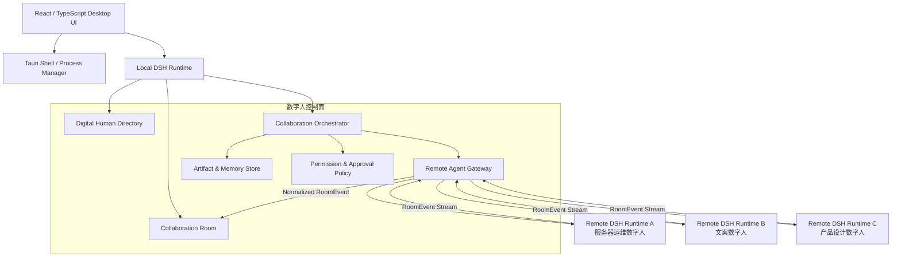
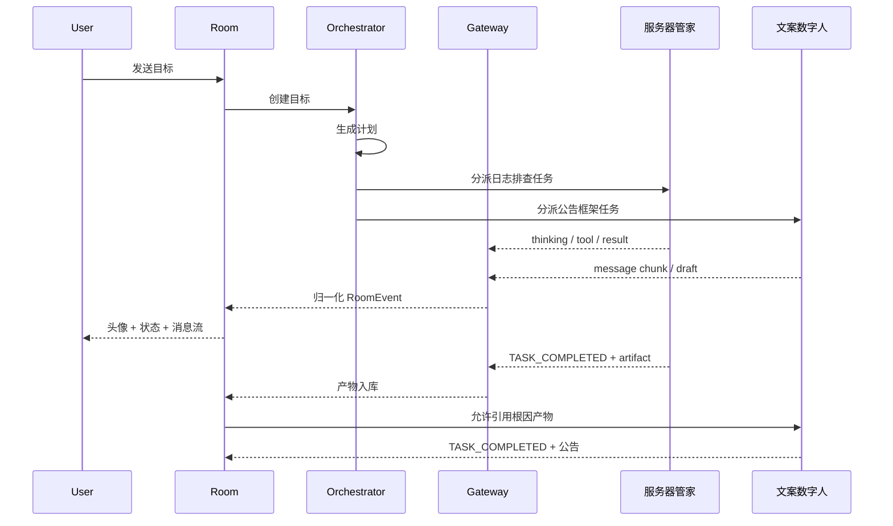
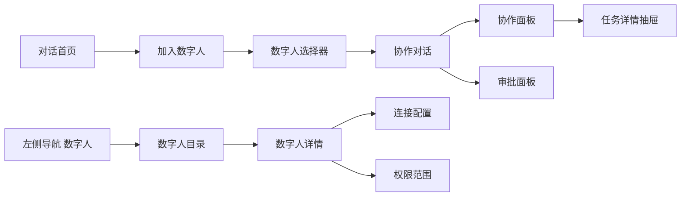

# DSH Java Desktop 数字人协作架构设计

## 1. 设计结论

本方案把“数字人”定义为**可被发现、被授权、可执行任务、可参与协作的 Agent 身份**，而不是一个只有头像的聊天入口。底层仍然是 DSH Java 的 Agent Runtime，上层通过数字人目录、协作房间、任务编排和统一事件协议，把本地与远端多个 `deepseek-harness-java` 服务组织成可用的数字员工团队。

核心原则：

1. **桌面端只做一个协作控制面**：不把多个远端服务的原始 API 直接散落在 React 里，而是由本地 DSH Runtime 或 Tauri 托管网关统一聚合。
2. **数字人与 Agent Runtime 解耦**：名称、头像、用途、权限、状态属于数字人身份；模型、工具、会话、执行属于被接入的 Runtime。
3. **聊天不是协作的唯一事实源**：任务、交接、审批、产物、状态变化必须进入结构化事件日志，聊天只是事件的投影。
4. **支持并行但不失控**：多个数字人可以同时工作，但必须有任务边界、权限边界、取消机制、超时机制和统一状态。
5. **本地优先，兼容开放协议**：第一版先使用 DSH Agent Card 和 DSH 协作协议，后续可映射到 MCP 与 A2A。

## 2. 现状能力评估

当前 `DSH Java Desktop` 已经具备：

- Tauri 桌面壳启动本地 `deepseek-harness-java` JAR；
- 本地 HTTP/SSE 调用 Agent Runtime；
- 工作区、会话、流式消息、模型配置、工具审批和插件面板；
- 本地服务进程托管、日志与启动状态管理。

当前 `deepseek-harness-java` 已经具备：

- ReactLoopAgent 主循环；
- SessionLog / SessionEvent 事件溯源；
- ToolRegistry、ToolCallExecutor、插件与 MCP 扩展；
- 任务提交、权限评估、审批、队列与执行；
- Workflow 编排雏形；
- 模型渠道与凭据管理。

因此，不应把数字人做成桌面端里的一组前端假身份，而应新增一个跨 Runtime 的**数字人协作域**。桌面端负责展示与操作，本地 DSH Runtime 负责发现远端数字人、建立协作房间、分发任务、汇聚事件、管理审批与产物。

## 3. 业界方案对照

### 3.1 MCP

MCP 解决模型与工具、资源、提示词之间的标准接入问题。DSH 已经有插件和工具注册机制，因此数字人不应该重新定义一套工具协议，而应该继续复用 MCP / ToolRegistry，并把每个数字人可见工具作为权限投影。

### 3.2 A2A

A2A 强调跨框架 Agent 互操作，核心包括 Agent Card 能力发现、长任务生命周期、SSE 流式交互和异步通知。这正好匹配本项目“接入多个远端 DSH 服务”的诉求。DSH 可以先实现一个兼容自身能力的 DSH Agent Card，后续保留向 A2A 映射的空间。

### 3.3 AutoGen / CrewAI / LangGraph

这些方案验证了几类多 Agent 协作模式：

- 角色型协作：按角色、目标、背景与工具组织多个 Agent；
- 群聊协作：Agent 之间通过消息轮转、分工与总结推进；
- 图/状态机协作：用显式节点、边、状态和检查点控制长任务；
- 人机协同：在关键节点暂停，等待用户确认或修改。

DSH 不建议直接把所有协作都做成自由群聊。自由群聊容易产生重复劳动、上下文膨胀和责任不清。更可用的机制是：**房间承载上下文与消息，任务承载分工与状态，Orchestrator 承载流转，事件日志承载审计与恢复**。

### 3.4 对本项目的启示

| 业界能力 | DSH 映射 |
| --- | --- |
| Agent Card | 数字人能力卡 / 服务接入卡 |
| Tool Protocol | DSH ToolRegistry / MCP 插件 |
| Task Lifecycle | 数字人任务与 DSH Task Queue |
| Streaming Event | DSH SessionEvent / RoomEvent |
| Graph Orchestration | 协作计划 + 任务 DAG + Workflow |
| Human in the Loop | DSH Approval / Runtime Approval |
| Observability | 数字人状态、TraceId、产物与审计日志 |

## 4. 总体架构



分层职责：

| 层 | 职责 |
| --- | --- |
| Desktop UI | 数字人列表、头像、邀请、消息气泡、任务面板、审批面板、状态指示 |
| Tauri Shell | 本地进程启动/停止、端口选择、日志、证书与系统权限 |
| Local Runtime | 数字人控制面、房间状态、事件聚合、远端网关、持久化 |
| Digital Human Directory | 管理数字人身份、用途、头像、能力、权限与连接配置 |
| Collaboration Room | 管理参与者、消息、任务、产物、状态和事件流 |
| Collaboration Orchestrator | 决定谁先做、谁等待、谁交接、谁校验、何时结束 |
| Remote Agent Gateway | 连接远端 DSH / 兼容服务，转换统一事件 |
| Artifact & Memory Store | 管理共享上下文、产物版本、摘要与来源 |
| Permission & Approval | 管理数字人可用工具、数据范围、危险操作审批 |

## 5. 数字人领域模型

### 5.1 数字人身份

```text
DigitalHuman
├─ id
├─ displayName
├─ avatarRef
├─ purpose
├─ roleTags: server-ops / copywriting / product-analysis / reviewer
├─ endpointType: local-dsh / remote-dsh / mcp-tool / future-a2a
├─ endpoint
├─ credentialRef
├─ agentCard
├─ capabilityManifest
├─ toolPolicy
├─ approvalPolicy
├─ concurrencyLimit
├─ healthState
└─ ownerScope
```

字段建议：

| 字段 | 是否必须 | 说明 |
| --- | --- | --- |
| 名称 | 必须 | 展示名，可在当前工作区内重名但建议全局唯一 |
| 头像 | 必须 | 支持系统头像、上传图片、Emoji 或图标包 |
| 用途描述 | 必须 | 给用户看的说明，也作为路由 Planner 的能力摘要 |
| 服务地址 | 远端必须 | 本地数字人可省略，远端数字人必须有 Base URL |
| 凭据 | 需要时必须 | 使用凭据引用，不把明文 API Key 存进普通业务表 |
| 能力标签 | 必须 | 例如 `server-ops`、`java-review`、`copywriting` |
| 工具范围 | 必须 | 决定该数字人可使用哪些工具或 MCP Server |
| 审批策略 | 必须 | 例如只读自动、写操作审批、远端危险命令逐次审批 |
| 并发上限 | 必须 | 避免同一数字人被同时塞入过多任务 |
| 健康状态 | 自动生成 | `online`、`offline`、`unauthorized`、`degraded` |

### 5.2 数字人能力卡

远端 DSH 服务建议暴露：

```http
GET /.well-known/dsh-agent-card
```

示例结构：

```json
{
  "schemaVersion": "1.0",
  "digitalHumanId": "ops-linux",
  "displayName": "服务器管家",
  "avatarUrl": "/assets/ops-linux.png",
  "purpose": "负责服务器巡检、日志排查、部署脚本与变更回滚。",
  "roleTags": ["server-ops", "deployment"],
  "capabilities": [
    {
      "name": "server-inspection",
      "description": "检查进程、端口、磁盘与错误日志",
      "input": "objective",
      "output": "report"
    }
  ],
  "tools": ["fs.read", "shell.execute", "terminal"],
  "approvalPolicy": "WRITE_REQUIRES_APPROVAL",
  "maxConcurrentTasks": 2,
  "protocol": "dsh.v1",
  "endpoints": {
    "tasks": "/api/harness/tasks/submit",
    "stream": "/api/agent/stream",
    "approvals": "/api/harness/approvals",
    "events": "/api/digital-humans/events"
  }
}
```

能力卡应该与运行配置分离：能力卡描述“我能做什么、接什么任务、输出什么”，连接配置描述“在哪里、用什么凭据、受什么本地策略约束”。

### 5.3 协作房间

```text
CollaborationRoom
├─ roomId
├─ projectId / workspaceId
├─ title
├─ objective
├─ participants: List<Participant>
├─ sharedContext: ContextManifest
├─ tasks: List<CollaborationTask>
├─ artifacts: List<Artifact>
├─ eventLog: List<RoomEvent>
├─ orchestrationMode
├─ runState
└─ budgetPolicy
```

```text
Participant
├─ participantId
├─ digitalHumanId
├─ joinedAt
├─ roomRole: member / planner / reviewer / observer
├─ presence: idle / thinking / working / waiting / blocked / done / error
└─ activeTaskIds: List<taskId>
```

### 5.4 协作任务

```text
CollaborationTask
├─ taskId
├─ roomId
├─ parentTaskId
├─ title
├─ instruction
├─ assignedTo
├─ requestedBy: user / digitalHuman / orchestrator
├─ state
├─ dependencies: List<taskId>
├─ inputArtifactIds
├─ outputArtifactIds
├─ deadline / timeout
├─ retryPolicy
├─ traceId
└─ approvalId
```

任务状态：

```text
DRAFT
  -> READY
  -> ASSIGNED
  -> RUNNING
  -> WAITING_INPUT
  -> WAITING_APPROVAL
  -> REVIEWING
  -> COMPLETED

任一阶段可进入 FAILED / CANCELED / TIMEOUT
```

状态只能由领域服务修改，不能由 UI 直接更新。UI 的按钮应转换为命令，例如 `StartTask`、`CompleteTask`、`RequestHandoff`、`CancelTask`。

## 6. 服务接入协议

### 6.1 接入模式

| 模式 | 说明 | 第一版建议 |
| --- | --- | --- |
| 本地 DSH 数字人 | 本地 Runtime 内的 Profile / Plugin / Agent 配置 | 支持 |
| 远端 DSH 数字人 | 任意机器上的 DSH 服务，通过 DSH API 接入 | 支持 |
| DSH Agent Group | 一个远端服务暴露多个数字人 Profile | 支持 |
| MCP 工具型数字人 | 只暴露工具，不承担完整协作角色 | 后续支持 |
| A2A Agent | 外部框架 Agent，通过 A2A 协议接入 | 预留 |

### 6.2 添加远端数字人流程

1. 用户在桌面端选择「添加数字人」。
2. 填写 Base URL、Token、名称、头像、用途描述。
3. Desktop 先探测 `/.well-known/dsh-agent-card`。
4. 如果远端是 DSH，读取数字人名称、头像、能力、工具、审批策略。
5. 用户确认接入范围，例如允许任务、允许流式事件、允许远端写操作。
6. Desktop 保存连接和凭据引用，随后做健康检查。
7. 数字人出现在目录中，可被邀请进入房间。

兼容性要求：

1. 远端必须有版本号或协议版本。
2. 远端必须返回稳定 `digitalHumanId`，桌面端用 `endpoint + digitalHumanId` 做唯一键。
3. 头像可以是 URL，也可以是桌面端缓存的资源；前端不应依赖远端地址直接展示头像。
4. 远端不可达时，目录中仍显示离线状态，但不能误报为本地服务异常。
5. Token 只保存在 Tauri 安全存储或本地 Runtime 的凭据存储，不进入 React state 和普通日志。

### 6.3 统一 RoomEvent

远端服务可能有自己的 SSE 格式，桌面端和本地 Runtime 需要统一事件模型：

```json
{
  "eventId": "evt_01J9...",
  "roomId": "room_01J9...",
  "taskId": "task_01J9...",
  "traceId": "trace_01J9...",
  "participantId": "participant_01J9...",
  "digitalHumanId": "ops-linux",
  "type": "TOOL_RESULT",
  "occurredAt": "2026-09-15T10:30:00Z",
  "visibility": "room",
  "payload": {
    "toolName": "shell.execute",
    "summary": "检查 nginx 进程",
    "resultRef": "artifact_01J9..."
  },
  "rendering": {
    "kind": "tool-card",
    "title": "执行检查",
    "severity": "info"
  }
}
```

基础事件类型：

| 事件 | 用途 |
| --- | --- |
| `PARTICIPANT_JOINED` | 数字人加入房间 |
| `PARTICIPANT_STATUS_CHANGED` | 思考中 / 执行中 / 等待 / 完成 / 失败 |
| `MESSAGE_CREATED` | 数字人向房间发送最终消息 |
| `MESSAGE_CHUNK` | 流式文本 |
| `REASONING_CHUNK` | 展开推理过程，可按权限隐藏 |
| `TOOL_CALL` | 显示工具调用意图 |
| `TOOL_RESULT` | 显示工具执行结果 |
| `TASK_CREATED` | 创建协作任务 |
| `TASK_ASSIGNED` | 分派给某个数字人 |
| `TASK_STATE_CHANGED` | 任务状态变化 |
| `HANDOFF_REQUESTED` | 数字人请求交接 |
| `APPROVAL_REQUIRED` | 需要用户确认 |
| `APPROVAL_RESOLVED` | 审批通过或拒绝 |
| `ARTIFACT_CREATED` | 产生文档、报告、补丁、脚本等产物 |
| `ERROR` | 错误与可恢复建议 |

必须保留 `eventId`、`roomId`、`participantId`、`taskId`、`traceId` 和 `occurredAt`。事件不能只靠前端数组顺序来恢复协作过程。

## 7. 协作机制设计

### 7.1 三种协作层级

#### A. 手动 @ 指定

用户明确 @ 某个数字人：

```text
@服务器管家 检查当前服务器为什么 CPU 很高
```

适合简单、明确、单角色任务。桌面端把消息转成 `CollaborationTask`，分配给该数字人。

#### B. 用户发起，Planner 分工

用户把多个数字人加入房间后描述目标：

```text
请分析线上服务异常，给出原因、修复方案和用户公告。
```

Orchestrator 根据数字人能力卡生成计划：

```text
1. 服务器管家：收集服务日志和系统指标
2. 产品分析师：梳理影响范围与用户问题
3. 文案数字人：基于结论生成公告
4. 服务器管家：确认修复步骤风险
5. Planner：汇总最终答案
```

计划生成后可以：

1. 自动开始；
2. 等待用户确认；
3. 逐个节点开始；
4. 允许无依赖节点并行。

#### C. 数字人主动交接

数字人完成任务后可以请求交接：

```json
{
  "type": "HANDOFF_REQUESTED",
  "from": "ops-linux",
  "to": "copywriter",
  "taskId": "task_public_notice",
  "reason": "日志结论已产出，需要生成用户公告。",
  "artifactIds": ["artifact_root_cause"]
}
```

交接要带 `taskId`、`reason`、`artifactIds` 和建议输出，不能只发一句聊天。

### 7.2 执行模型



### 7.3 上下文与记忆

不建议把完整房间记录原样发给每个数字人。应拆成四类上下文：

| 上下文 | 内容 | 可见范围 |
| --- | --- | --- |
| 任务上下文 | 目标、约束、输入、验收标准 | 执行者与必要审批者 |
| 房间上下文 | 参与者、角色、当前计划 | 房间内成员 |
| 共享产物 | 根因报告、代码补丁、公告草稿 | 按任务依赖授权 |
| 私有记忆 | 服务端文件、凭据、历史会话摘要 | 所属数字人 |

数字人之间不共享凭据。上下文传递使用引用，而不是把敏感内容复制进提示词。若必须引用，需要经过策略层脱敏。

### 7.4 产物

产物是协作结果的一等公民：

```text
Artifact
├─ artifactId
├─ roomId
├─ taskId
├─ producerId
├─ kind: text / markdown / code-patch / report / command-result / file
├─ title
├─ version
├─ contentRef
├─ provenance: traceId / sourceEvents
├─ riskLevel
└─ visibility
```

典型流程：

1. 服务器管家产出「根因报告」；
2. 产品分析师基于报告补充影响面；
3. 文案数字人基于报告与影响面生成公告；
4. 用户确认后公告进入最终产物；
5. 所有产物保留来源与版本，方便追问。

### 7.5 并发与调度

Orchestrator 需要维护以下约束：

1. 每个数字人有并发上限；
2. 同一任务不会重复派发；
3. 有依赖的任务必须等待上游产物；
4. 无依赖任务可以并行；
5. 危险操作必须等待审批；
6. 任务有超时和取消；
7. 失败后可选择重试、换人或降级为人工处理；
8. 长任务必须有心跳或进度事件。

### 7.6 决策与仲裁

当多个数字人给出冲突结论时，不能简单让模型继续聊到随机收敛。推荐机制：

1. 标记为 `CONFLICT`；
2. 生成差异表：结论、证据、风险、置信度；
3. 指定 Reviewer 或用户仲裁；
4. 仲裁结论写入房间共享上下文；
5. 后续任务只能引用仲裁后的结论。

## 8. 桌面端交互设计

### 8.1 设计目标

数字人界面必须同时满足三种使用方式：

1. **扫一眼知道谁在做什么**：头像、名称、任务、状态、产物来源必须一眼可见。
2. **三步内完成关键动作**：添加数字人、邀请进入房间、审批或取消任务。
3. **复杂协作不混乱**：并行任务通过任务流、分组、折叠和时间线管理，而不是让所有日志挤进聊天。

因此，UI 采用「**主对话看结果，右侧面板看过程，任务抽屉看全量**」的信息分层：

```text
主对话区：用户输入、数字人最终回复、关键工具卡、审批条、产物卡。
右侧协作面板：参与者状态、当前计划、活跃任务、等待审批、最新产物。
全量任务抽屉：任务 DAG、依赖关系、事件时间线、失败原因、重试入口。
```

### 8.2 视觉语言

继续沿用当前 Desktop 的白色工作台风格：

| 类别 | 规范 |
| --- | --- |
| 画布 | 浅灰白底，避免大面积纯黑 |
| 卡片 | 白色面板、1px 边框、12-16px 圆角、轻阴影 |
| 主色 | 保留现有品牌主色作为主要按钮和焦点色 |
| 角色色 | 每个数字人有稳定主题色，用于头像环、任务条和进度指示 |
| 状态色 | 绿色=完成，蓝色=执行，紫色=思考，橙色=等待，红色=错误，灰色=暂停 |
| 字号 | 标题 15-16px，正文 14px，辅助信息 12-13px |
| 行高 | 中文正文 1.55-1.65，代码和命令用等宽字体 |
| 间距 | 4 / 8 / 12 / 16 / 24 / 32px 阶梯 |
| 圆角 | 小按钮 8px，卡片 12px，弹层 14px，头像支持圆形或 10px 方圆 |
| 动效 | 120-220ms；只强调状态变化、展开折叠和焦点移动 |

数字人头像应优先使用 `40px` 方形或圆形。头像外圈使用 2px 主题色或状态色；远端不可用时置灰并叠加离线角标。头像下不做复杂动画，避免多数字人同时工作时视觉过载。

### 8.3 信息架构与入口

建议新增四个入口：

1. **左侧导航「数字人」**：进入数字人目录。
2. **设置页「连接与数字人」**：管理远端连接、凭据、权限和健康状态。
3. **对话顶部「加入数字人」**：邀请成员进入当前房间。
4. **对话右侧「协作面板」**：查看任务、状态、产物和审批。

导航关系：



### 8.4 核心页面与流程

#### A. 对话首页

首页仍保持当前「今天要做什么？」的轻量体验，但在提示输入框下新增数字人建议区：

```text
今天要做什么？

[描述任务或粘贴上下文]

可用数字人：
[服务器管家 · 在线] [文案助手 · 在线] [产品分析师 · 在线] [+]
```

交互规则：

1. 点击头像卡片即加入当前对话；
2. 再次点击可取消选择；
3. 已选数字人在输入框上方形成 chip；
4. 可输入 `@` 快速唤起成员选择器；
5. 如果没有任何数字人，显示低调的「添加第一个数字人」，不抢主输入区焦点。

#### B. 数字人选择器

点击「加入数字人」后展示侧滑面板或Popover：

```text
加入数字人

[搜索：名称 / 用途 / 能力]

推荐
服务器管家   服务器巡检、日志排查、部署      [加入]
文案助手     产品公告、操作说明、发布文案    [加入]

全部
产品分析师   需求拆解、竞品与影响面分析      [加入]
Java Reviewer 代码审查、构建与测试          [加入]
```

卡片内容包含：

1. 头像；
2. 名称；
3. 一句话用途；
4. 能力标签，最多展示 3 个；
5. 在线状态；
6. 当前任务数 / 并发上限；
7. 权限摘要，例如「远端 / 写操作需审批」。

设计细节：

1. 搜索必须同时匹配名称、用途、能力标签；
2. 离线数字人仍可选择，但要出现黄色提示「连接离线，加入后任务会等待恢复」；
3. 无权限数字人显示禁用态和原因；
4. 连续点击同一头像不应创建重复参与者；
5. 支持键盘 `↑ / ↓ / Enter / Esc`。

#### C. 协作对话布局

建议采用三栏自适应布局：

```text
306px 左侧导航       自适应中间对话        320px 右侧协作面板
┌────────────┐ ┌──────────────────────┐ ┌────────────┐
│ 项目/会话   │ │ 房间标题 + 成员栏     │ │ 当前目标   │
│ 导航       │ │ 消息流               │ │ 参与者     │
│ 数字人入口 │ │ 工具卡 / 产物卡       │ │ 任务列表   │
│            │ │ 审批条               │ │ 等待审批   │
│            │ │ 输入区               │ │ 产物       │
└────────────┘ └──────────────────────┘ └────────────┘
```

窗口较窄时折叠右侧面板为图标按钮；用户点击后覆盖展开。主对话区最小宽度不应小于 560px。

房间顶部结构：

```text
[房间标题：线上异常分析]
目标：分析服务异常，输出根因、修复方案和用户公告
[服务器管家 ●执行中] [文案助手 ●等待中] [产品分析师 ●空闲] [+]
```

成员栏细节：

1. 头像可横向滚动；
2. 头像右上角显示状态点；
3. 悬停显示能力和当前任务；
4. 点击头像打开成员详情卡；
5. 末尾固定「+」按钮；
6. 超过 5 个成员时折叠为 `+3`。

#### D. 消息与事件展示

消息不再只有 `user` / `assistant`，应渲染为多角色事件流。

用户消息：

```text
[You] 请分析线上服务异常，给出原因、修复方案和用户公告。
```

数字人普通回复：

```text
[头像] 服务器管家                        10:31
初步判断 worker 进程异常，已收集最近 30 分钟日志。
[查看根因报告]
```

数字人执行过程：

```text
[头像] 服务器管家                        10:32
正在检查 nginx 日志…                    任务 #T-12
├─ 工具：shell.execute
├─ 参数摘要：tail -n 500 /var/log/nginx/error.log
├─ 结果：发现 3 个 worker 异常
└─ 状态：等待审批
```

分组规则：

1. 同一数字人的连续流式 chunk 必须合并；
2. 工具调用和结果合并为一张工具卡；
3. 任务状态变化默认只更新状态胶囊，不额外插入独立消息；
4. 只有计划变更、结果产出、失败、审批、交接才生成显式消息；
5. 长日志默认折叠，显示摘要和「查看完整输出」；
6. 敏感命令默认掩码显示，审批弹窗里才完整展示。

#### E. 右侧协作面板

面板按优先级分四组：

1. **当前目标**：目标、计划模式、预估时长、取消按钮；
2. **参与者**：头像、状态、当前任务、快捷操作；
3. **任务**：当前活跃任务、等待任务、已完成任务；
4. **产物与审批**：最新产物和需要用户处理的审批。

任务卡示例：

```text
#T-12 收集服务日志与指标
服务器管家 ●执行中
进度 3/5 · 已运行 02:14
────────────────────
产出：初步根因假设
操作：查看 · 停止
```

审批卡示例：

```text
需要确认
服务器管家请求执行 shell.execute
命令摘要：systemctl restart nginx
风险：服务重启
[查看详情] [拒绝] [允许一次]
```

### 8.5 数字人目录页

目录页采用列表 + 详情双栏：

```text
数字人
[+ 添加数字人]

左侧列表
服务器管家    远端 DSH · 在线 · 1/2 任务
文案助手      远端 DSH · 在线 · 0/1 任务
产品分析师    本地 · 空闲

右侧详情
[头像] 服务器管家
用途：负责服务器巡检、日志排查、部署脚本与变更回滚。
来源：https://ops.example.com
协议：DSH v1
状态：在线

能力
服务器巡检 · 日志排查 · 部署脚本

权限
读操作：自动
写操作：需要审批
服务重启：每次确认

最近任务
#T-12 收集服务日志与指标       完成
#T-08 检查磁盘空间             完成
```

添加数字人分步：

```text
第 1 步 选择来源
本地 DSH / 远端 DSH / 后续 MCP 或 A2A

第 2 步 连接
Base URL、Token、协议版本、连接测试

第 3 步 身份
名称、头像、用途、能力确认

第 4 步 权限
可用工具、资源范围、审批策略、并发上限

第 5 步 确认
摘要卡片 + 添加
```

表单要求：

1. 每一步只问必要信息；
2. 远端地址失焦后自动探测 Agent Card；
3. 名称和头像可以从 Agent Card 预填，用户可修改；
4. Token 使用密码框、可临时显示、不进入普通日志；
5. 连接失败必须区分 DNS、TLS、401、404、协议不兼容；
6. 最后一步展示「将要授予的能力」和「不会共享的信息」。

### 8.6 数字人详情卡

在对话中点击头像后显示Popover或侧滑卡：

```text
[头像] 服务器管家
状态：执行中
来源：远端 DSH
用途：服务器巡检、日志排查、部署脚本与变更回滚。

当前任务
#T-12 收集服务日志与指标

能力
服务器巡检 / 日志排查 / 部署脚本

本次房间权限
读文件：允许
执行命令：需要审批
重启服务：每次审批

[查看完整资料] [暂停] [移出房间]
```

操作约束：

1. 「暂停」必须显示当前任务是否会被中断；
2. 「移出房间」如果该成员还有任务，需要二次确认；
3. 「查看完整资料」跳转目录详情；
4. 所有变更操作写入审计日志；
5. 用户不能通过详情卡直接修改远端服务端配置，只能修改本地接入策略。

### 8.7 状态系统

| 状态 | 含义 | 视觉 | 主对话反馈 | 右侧面板 |
| --- | --- | --- | --- | --- |
| `idle` | 已加入，未执行任务 | 灰色状态点 | 不插入消息 | 显示「空闲」 |
| `thinking` | 正在生成计划或回答 | 紫色呼吸点 | 合并气泡显示思考中 | 显示当前任务 |
| `working` | 正在执行任务或工具 | 蓝色进度条 | 更新工具卡 | 显示进度和耗时 |
| `waiting-input` | 等待用户输入 | 橙色点 | 消息末尾显示输入入口 | 置顶任务 |
| `waiting-approval` | 等待审批 | 橙色盾牌 | 显示审批条 | 审批卡置顶 |
| `blocked` | 依赖未满足或服务不可用 | 灰色锁点 | 显示阻塞原因 | 任务显示依赖 |
| `done` | 当前任务完成 | 绿色对勾 | 显示产物卡 | 任务移动到完成组 |
| `error` | 当前任务失败 | 红色警告 | 显示错误卡和重试 | 显示失败原因 |

状态规则：

1. 同一数字人并行执行多任务时，头像状态取最高优先级：`error > waiting-approval > waiting-input > working > thinking > blocked > done > idle`；
2. 状态变化必须由 RoomEvent 驱动，前端不允许自行推测；
3. 长时间无心跳时把 `working` 显示为「连接不稳定」，不自动改成失败；
4. 任务完成时头像状态短暂显示「完成」，2 秒后回到其真实状态。

### 8.8 任务详情抽屉

右侧任务卡点击后展开全屏抽屉或大侧栏：

```text
任务 #T-12 收集服务日志与指标
状态：执行中 · 服务器管家
开始时间：10:31 · 已运行：02:14

目标
收集最近 30 分钟服务日志与系统指标，输出初步根因假设。

依赖
无

事件时间线
10:31 TASK_ASSIGNED
10:31 TOOL_CALL shell.execute
10:32 TOOL_RESULT 发现 3 个 worker 异常
10:33 APPROVAL_REQUIRED systemctl restart nginx

产物
初步根因假设 markdown · v1

操作
[查看原始事件] [停止任务]
```

抽屉要求：

1. 事件时间线支持按消息、工具、状态、审批过滤；
2. 每个事件可跳回主对话对应卡片；
3. 失败任务展示错误码、用户可读原因和建议动作；
4. 产物显示版本、生成者、来源事件和大小；
5. 支持复制 TraceId，便于技术排查。

### 8.9 空态、加载态与异常态

| 场景 | 展示 | 动作 |
| --- | --- | --- |
| 没有数字人 | 首页显示轻量引导卡 | 「添加数字人」 |
| 数字人离线 | 灰头像 + 黄色提示 | 重试连接 / 仍加入 |
| Agent Card 探测失败 | 保留用户输入内容 | 编辑地址 / 重试 |
| Token 无效 | 显示 401，不暴露 Token | 修改凭据 |
| 协议不兼容 | 显示远端版本和建议 | 查看兼容说明 |
| 事件断线 | 顶部轻提示「正在重连事件流」 | 自动重连 |
| 历史加载中 | 骨架屏，不闪空态 | 等待 |
| 任务失败 | 红色错误卡 + 摘要 | 重试 / 换人 / 取消 |
| 权限不足 | 禁用按钮 + 原因 | 调整权限 |
| 审批超时 | 状态变为已取消 | 重新发起 |

异常文案必须回答三件事：

1. 发生了什么；
2. 对当前任务的影响；
3. 用户现在可以做什么。

示例：

```text
远端服务暂不可达
「服务器管家」的任务 #T-12 已暂停，不会继续读取服务器日志。
可以重试连接，或将任务转交其他数字人。
```

### 8.10 输入区设计

输入区保持当前简洁样式，并新增数字人控制：

```text
[已加入：服务器管家 · 文案助手] ×

[描述任务，或粘贴需求上下文]

[@指定成员] [+ 上下文] [审批策略]                    [发送]
```

行为：

1. 输入 `@` 后展示成员选择器；
2. 没有任何 `@` 且房间只有一个数字人时，默认只派发给该数字人；
3. 没有任何 `@` 且有多个数字人时，默认进入 `AUTO_PLAN`，发送前显示「将自动分工」；
4. 用户可切换 `自动分工`、`只执行选中`、`草稿不发送`；
5. 发送按钮在任务提交后变为「停止」，只能停止本次发起的协作链；
6. 粘贴大文本自动折叠为上下文引用，不直接塞进输入框。

### 8.11 引导与信任设计

首次添加远端数字人时，界面需要明确告知：

1. 本地会把哪些信息发送给远端；
2. 远端可以使用哪些工具；
3. 哪些操作需要用户审批；
4. 凭据保存在哪里；
5. 如何随时停用或删除。

建议在确认页使用两栏对照：

```text
将启用
- 接收你明确派发的任务
- 读取服务器日志和系统指标
- 生成诊断报告

需要审批
- 修改服务器文件
- 执行写命令
- 重启服务

不会共享
- 本地其他项目文件
- 其他数字人的凭据
- 未被任务引用的历史会话
```

### 8.12 无障碍与细节体验

1. 所有可交互元素有可见焦点；
2. 头像必须有 `alt` 或 `aria-label`；
3. 状态不能只靠颜色表达，要叠加图标或文字；
4. 审批主操作不要默认聚焦，避免误按回车；
5. 工具卡展开状态要有 `aria-expanded`；
6. 长列表支持键盘上下移动；
7. 弹层打开时焦点进入弹层，关闭后回到触发按钮；
8. 系统开启减少动效时禁用呼吸和位移动画；
9. 中文换行避免标点悬挂在行首；
10. 深浅主题变化时不能只靠固定白色。

### 8.13 UI 验收标准

1. 用户能在 3 步内添加远端 DSH 数字人；
2. 用户能在 2 步内把数字人加入当前对话；
3. 主对话任意消息可看出归属数字人、时间和任务；
4. 并行执行 3 个数字人时主对话仍保持可读；
5. 审批请求在主对话和右侧面板同时可见；
6. 所有按钮禁用时给出原因，而不是无提示置灰；
7. 断线、失败、权限不足都有恢复入口；
8. 刷新或重连后消息、任务、产物状态能恢复；
9. 键盘可完成邀请、发送、审批和取消；
10. 窗口缩到 1024px 时右侧面板可折叠，不遮挡主输入区。


## 9. API 与事件面

### 9.1 数字人目录 API

```http
GET    /api/digital-humans
POST   /api/digital-humans
GET    /api/digital-humans/{id}
PUT    /api/digital-humans/{id}
DELETE /api/digital-humans/{id}
POST   /api/digital-humans/{id}/health-check
POST   /api/digital-humans/discover
```

`discover` 请求远端 Agent Card，返回建议名称、头像、能力、协议版本和健康状态。

### 9.2 房间与协作 API

```http
POST /api/collaboration/rooms
GET  /api/collaboration/rooms/{roomId}
POST /api/collaboration/rooms/{roomId}/participants
POST /api/collaboration/rooms/{roomId}/messages
POST /api/collaboration/rooms/{roomId}/tasks
POST /api/collaboration/tasks/{taskId}/cancel
POST /api/collaboration/tasks/{taskId}/approve
POST /api/collaboration/tasks/{taskId}/reject
GET  /api/collaboration/rooms/{roomId}/events
GET  /api/collaboration/rooms/{roomId}/artifacts
```

`events` 使用 SSE 或 WebSocket，推荐先使用 SSE，复用现有 Web 能力。

### 9.3 命令示例

用户发送：

```json
{
  "roomId": "room_01J9...",
  "content": "请分析线上服务异常，给出原因、修复方案和用户公告。",
  "mentions": [],
  "orchestration": "AUTO_PLAN"
}
```

Orchestrator 返回计划事件：

```json
{
  "type": "TASK_ASSIGNED",
  "taskId": "task_collect_logs",
  "payload": {
    "assignedTo": "ops-linux",
    "instruction": "收集最近 30 分钟服务日志与系统指标，输出初步根因假设。",
    "outputContract": "markdown-report"
  }
}
```

### 9.4 事件流

本地 Runtime 聚合远端事件后统一推给 Desktop：

```text
Remote Event -> Remote Adapter -> Normalized RoomEvent -> Room Event Log -> UI Projector
```

UI Projector 不改变领域状态，只负责把事件转换成：

1. 聊天消息；
2. 工具卡片；
3. 状态胶囊；
4. 任务列表；
5. 产物列表；
6. 审批提醒。

## 10. 安全、权限与治理

### 10.1 权限模型

权限应同时看五个维度：

```text
数字人 + 工作区 + 工具 + 目标资源 + 审批模式
```

示例：

| 数字人 | 可用工具 | 资源范围 | 审批策略 |
| --- | --- | --- | --- |
| 服务器管家 | shell、terminal、fs.read | 指定服务器目录 | 读自动，写和重启逐次审批 |
| 文案数字人 | 知识库、文档导出 | 产品知识库 | 自动 |
| 产品分析师 | 知识库、网页阅读、文档读取 | 需求文档 | 自动 |
| Java Reviewer | 代码读取、构建、测试 | 指定仓库 | 测试自动，提交需审批 |

### 10.2 远端服务安全

1. 所有远端连接默认 HTTPS，本地开发允许显式开启 HTTP。
2. Token 使用最小权限，不把桌面端用户本地凭据传给远端。
3. 远端只能看到明确授权的任务上下文。
4. 远端返回的链接、文件路径、命令必须在 UI 做安全展示，不自动执行。
5. 远端事件需要校验来源，防止把未授权服务伪装成数字人。
6. 每个远端数字人应有独立限流和熔断。

### 10.3 审批

审批不是全局开关，而是数字人、任务和工具的组合策略：

```text
AUTO_ALLOW
ALLOW_ONCE
ALLOW_SESSION
DENY
ESCALATE_TO_USER
```

审批内容至少包含：

1. 哪个数字人；
2. 哪个任务；
3. 请求哪个工具；
4. 访问哪个资源；
5. 关键参数摘要；
6. 风险等级；
7. TraceId。

### 10.4 可观测性

每次协作应有：

1. `traceId`；
2. `roomId`；
3. `taskId`；
4. 参与者；
5. 事件时间线；
6. 工具调用摘要；
7. 产物来源；
8. 错误与恢复动作。

日志里不落 API Key、完整文件内容和敏感命令输出，只落引用、摘要和哈希。

## 11. 数据存储建议

第一版可以继续使用本地 H2；后续多设备同步或团队使用时迁移到 MySQL。

| 表 | 职责 |
| --- | --- |
| `digital_human` | 数字人身份与展示配置 |
| `digital_human_endpoint` | 服务地址、协议版本、健康状态 |
| `digital_human_credential_ref` | 凭据引用，不存明文 |
| `digital_human_capability` | 能力标签、输入输出契约 |
| `collaboration_room` | 协作房间与目标 |
| `room_participant` | 参与者与状态 |
| `room_event` | 统一事件日志 |
| `collaboration_task` | 任务、状态、责任人 |
| `task_dependency` | 任务 DAG |
| `collaboration_artifact` | 产物与版本 |
| `collaboration_approval` | 审批记录 |
| `digital_human_audit_log` | 安全与治理审计 |

## 12. 关键技术决策

| 决策 | 结论 | 理由 |
| --- | --- | --- |
| 是否让前端直连远端 | 不建议 | CORS、Token 暴露、事件统一和安全策略都难做 |
| 是否把远端 Agent 当普通 MCP 工具 | 不建议 | 数字人需要任务、状态、产物与审批，普通工具表达不了完整生命周期 |
| 是否用自由群聊做主控 | 不建议 | 责任不清、上下文膨胀、难以恢复 |
| 是否为每个远端服务建立独立会话 | 是 | 保持远端 Runtime 自治，本地只保存协作投影 |
| 是否引入任务 DAG | 是 | 支持依赖、并行、重试、审批和可解释执行 |
| 是否复用 DSH SessionEvent | 是 | 避免重新实现事件溯源 |
| 是否新增 RoomEvent | 是 | SessionEvent 属于单 Agent 会话，跨数字人房间需要归一化事件 |
| 是否一开始做 A2A | 不强制 | 先定义 DSH Agent Card 和 v1 协议，保留映射层 |

## 13. 演进路线

#### 阶段 1：数字人身份与单房间

目标：先让数字人可见、可加、可 @。

1. 新增数字人表和 UI；
2. 支持名称、头像、用途描述；
3. 本地 DSH 数字人映射为 Profile 或 Plugin；
4. 消息渲染头像与数字人名称；
5. 支持 `@数字人` 触发；
6. 显示基本状态。

#### 阶段 2：远端 DSH 接入

目标：接入任意机器上的 DSH 服务。

1. 实现 DSH Agent Card；
2. 实现远端连接、健康检查、Token 管理；
3. 远端任务创建与 SSE 转发；
4. 远端事件归一化为 RoomEvent；
5. 支持离线、未授权、超时和重试状态。

#### 阶段 3：多数字人协作

目标：多个数字人在同一房间协作。

1. 房间参与者模型；
2. 任务创建、分配、取消；
3. Planner 自动分工；
4. 并行任务；
5. 产物与任务依赖；
6. 数字人状态与任务状态联动。

#### 阶段 4：审批、审计与治理

目标：达到真实工作可用。

1. 数字人级工具权限；
2. 工作区级资源范围；
3. 危险操作审批；
4. TraceId 审计；
5. 限流、熔断、重试；
6. 敏感数据脱敏。

#### 阶段 5：生态扩展

目标：从 DSH 内部走向开放生态。

1. 支持数字人导入导出；
2. 支持头像包和角色模板；
3. 支持 MCP 工具型数字人；
4. 支持 A2A Agent Card 映射；
5. 支持团队共享目录与云端控制面。

## 14. 最小可用闭环

第一版最小闭环不要求完整 Planner，也不要求 A2A，只要验证三件事：

1. **数字人有稳定身份**：名称、头像、用途、能力、在线状态。
2. **远端服务能变成数字人**：通过 Base URL 和凭据接入，可以创建任务并接收事件。
3. **房间事件可归属**：每条消息、工具卡、状态变化都能显示是谁产生的。

建议 MVP 场景：

```text
用户添加“服务器管家”远端 DSH 服务。
在对话中点击加入。
输入：@服务器管家 检查当前机器 nginx 是否异常。
桌面端创建任务。
远端 Runtime 执行工具并推送 SSE。
本地 Runtime 归一化为 RoomEvent。
UI 展示头像、状态、工具卡和结果。
任务完成后显示“服务器管家已完成”。
```

验收标准：

1. 桌面重启后数字人目录仍存在；
2. 远端服务不可达时状态正确；
3. 多个数字人可加入同一房间；
4. 每条消息可追溯到数字人、任务和 TraceId；
5. 工具审批不会落入错误数字人的会话；
6. 并行任务不会互相覆盖状态；
7. 断线重连后能按 `eventId` 补齐事件；
8. 审批通过或拒绝会实时反映到对应数字人。

## 15. 最终形态

最终形态可以概括为：

```text
数字人目录：谁存在，能做什么，在哪里，有什么权限。
协作房间：谁加入了这件事，上下文是什么。
任务编排：谁先做，谁并行，谁等待，谁校验。
统一事件：每一步是谁做的，为什么做，产出了什么。
安全治理：谁被允许做，什么时候需要人来确认。
产物系统：协作最终留下的不是闲聊，而是可复用结果。
```

这样，“数字人”才不只是桌面端里的头像，而是一个真正可管理、可协作、可审计、可演进的数字员工体系。
